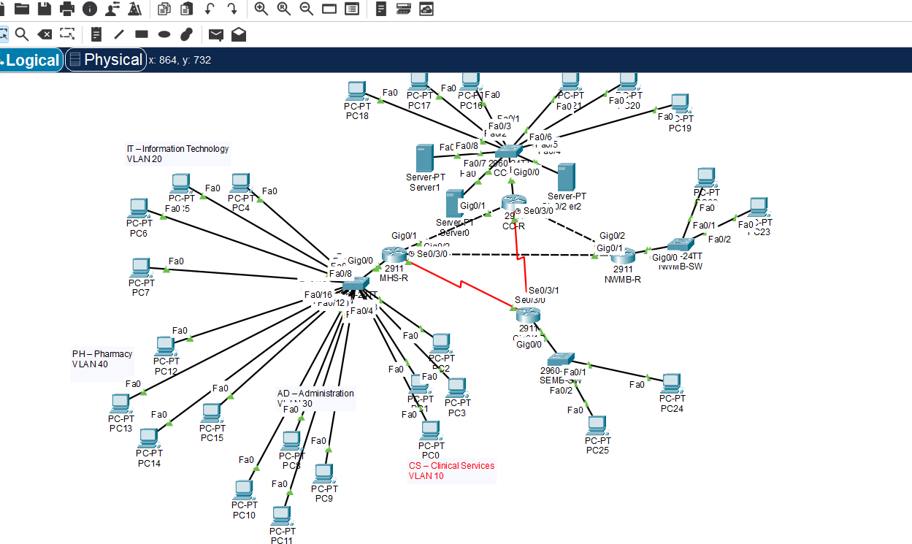
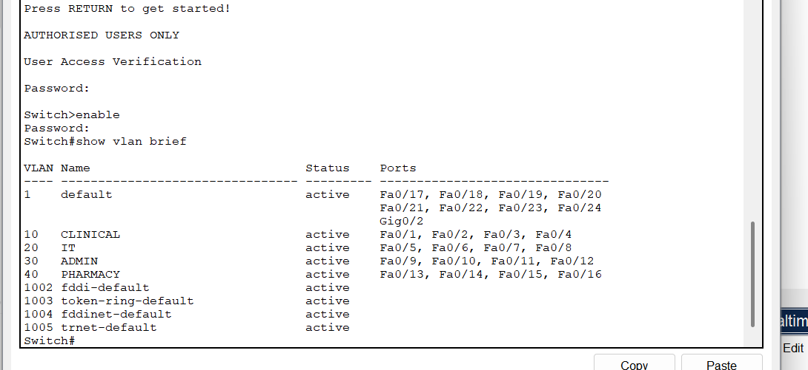
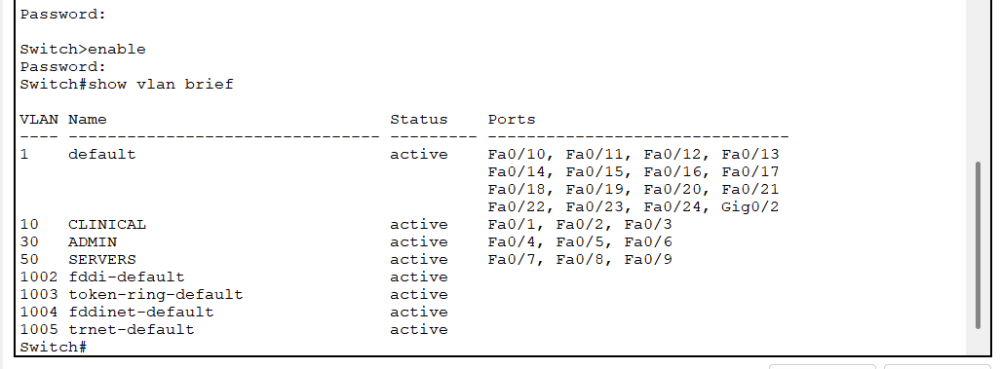
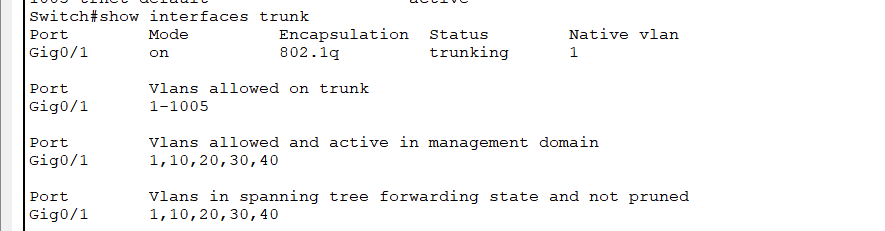
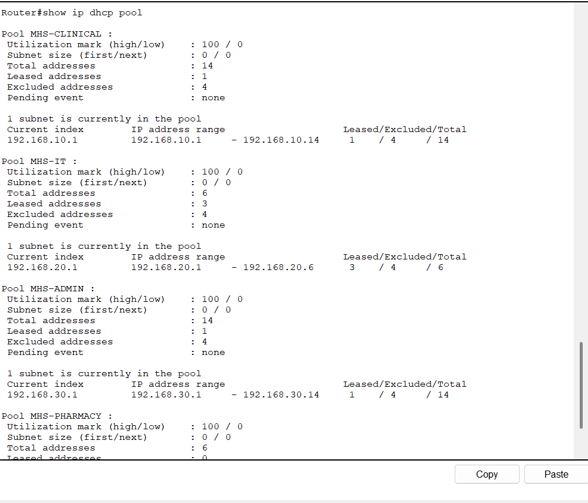
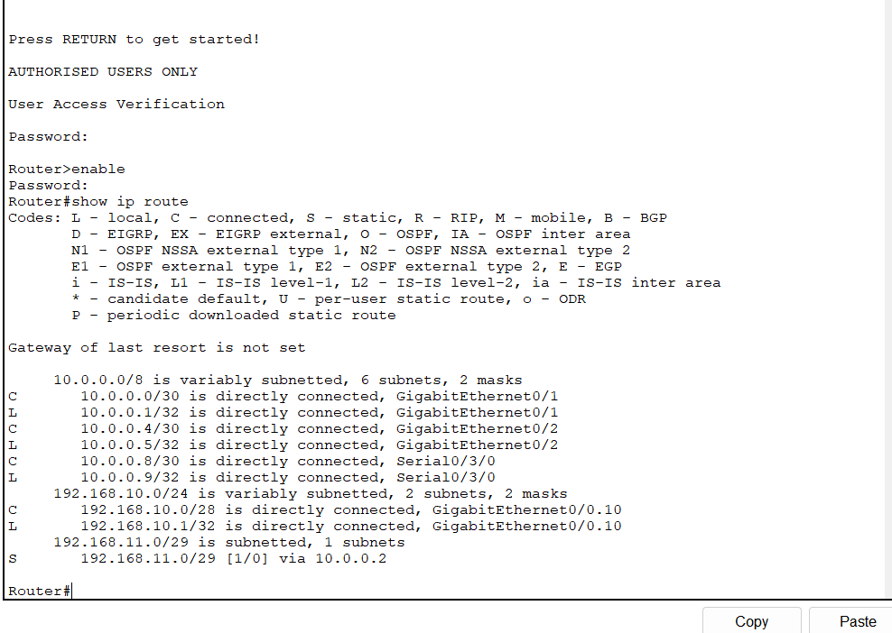
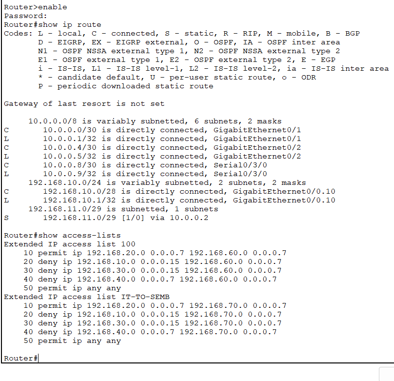
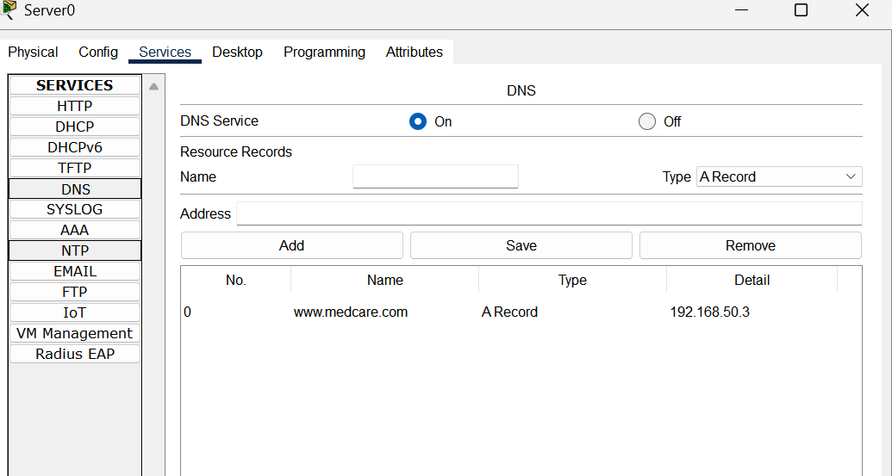
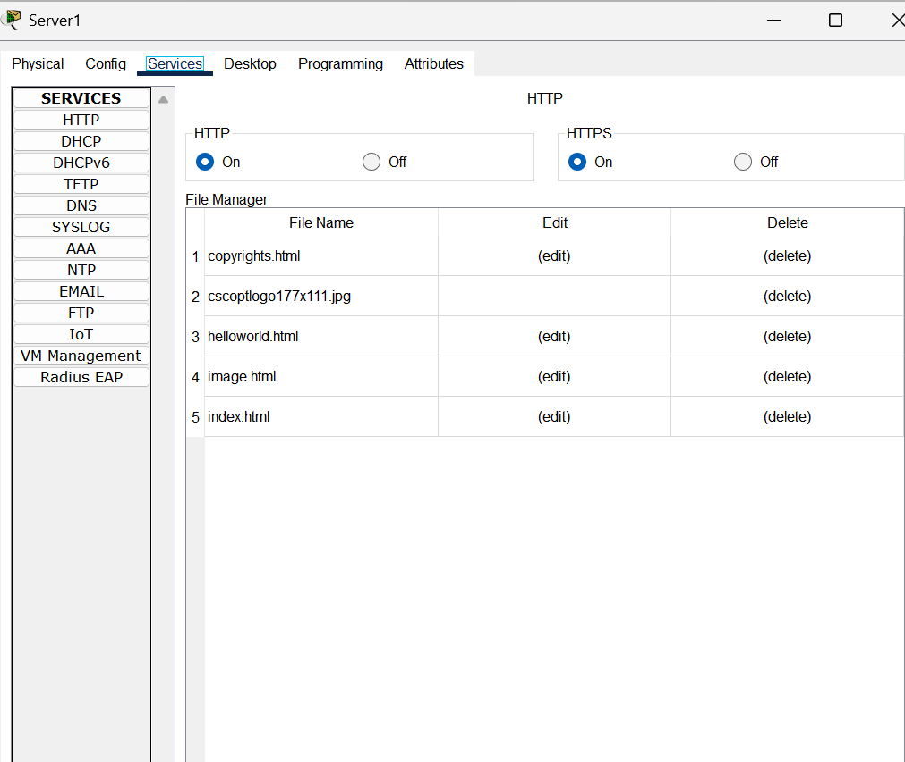
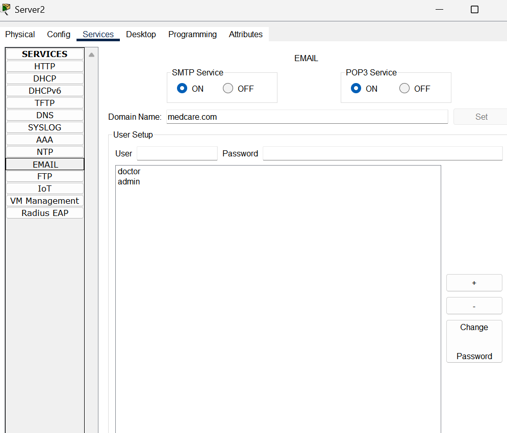

# 🏥 MedCare Health Services — Advanced Computer Network Design

A secure multi-site healthcare network designed and implemented using **Cisco Packet Tracer**, demonstrating practical skills in network design, VLAN segmentation, routing, network services, access control and Cisco IOS configuration.

---

## 📌 Project Overview

MedCare Health Services operates across four interconnected locations:

- **Main Hospital (MHS)**
- **Central Clinic (CC)**
- **North-West Medical Branch (NWMB)**
- **South-East Medical Branch (SEMB)**

The network was designed to provide reliable communication between healthcare locations while maintaining logical separation between departments and controlling access to remote networks.

The implementation includes:

- VLAN segmentation
- Classless IPv4 subnetting
- 802.1Q trunking
- Inter-VLAN routing
- DHCP
- DNS
- HTTP/HTTPS Web services
- SMTP/POP3 Email services
- Static WAN routing
- Extended Access Control Lists (ACLs)
- Cisco device access security
- Multi-site network connectivity

The complete working Cisco Packet Tracer network is included in this repository.

---

## 🏗️ Network Architecture

The network connects four healthcare locations using Cisco routers and switches.

The **Main Hospital (MHS)** contains separate departmental networks for:

- Clinical Services
- IT
- Administration
- Pharmacy

The **Central Clinic (CC)** provides additional departmental connectivity and hosts centralised network services including:

- DNS Server
- Web Server
- Email Server

The **North-West Medical Branch (NWMB)** and **South-East Medical Branch (SEMB)** are connected to the wider MedCare network through WAN links.

### Network Topology



---

## 🛠️ Technologies & Networking Concepts

| Technology / Concept | Implementation |
|---|---|
| Cisco Packet Tracer | Network design and simulation |
| Cisco 2911 Routers | Routing between networks and sites |
| Cisco 2960 Switches | LAN connectivity and VLAN segmentation |
| IPv4 | Network addressing and subnetting |
| VLANs | Departmental network segmentation |
| 802.1Q | VLAN trunking |
| Inter-VLAN Routing | Communication between VLANs |
| DHCP | Automatic IPv4 address allocation |
| DNS | Domain name resolution |
| HTTP / HTTPS | Web services |
| SMTP / POP3 | Email services |
| Static Routing | Inter-site WAN connectivity |
| Extended ACLs | Traffic filtering and access control |
| Cisco IOS CLI | Device configuration and administration |

---

## 🔀 VLAN Segmentation

VLANs are used to logically separate departments and provide controlled communication between different areas of the network.

At the Main Hospital, the following VLANs and IPv4 networks are configured:

| VLAN | Department | Network |
|---|---|---|
| 10 | Clinical Services | `192.168.10.0/28` |
| 20 | IT | `192.168.20.0/29` |
| 30 | Administration | `192.168.30.0/28` |
| 40 | Pharmacy | `192.168.40.0/29` |

This design provides logical network separation between departments and supports the application of network access policies.

### Main Hospital VLAN Configuration



### Central Clinic VLAN Configuration



---

## 🔗 802.1Q Trunking

802.1Q trunking is configured to transport traffic belonging to multiple VLANs across the network infrastructure.

The Main Hospital trunk carries:

- VLAN 10 — Clinical Services
- VLAN 20 — IT
- VLAN 30 — Administration
- VLAN 40 — Pharmacy

The trunk configuration verifies that these VLANs are active and forwarding traffic.



---

## 🌐 Inter-VLAN Routing

Router subinterfaces provide Layer 3 connectivity between the departmental VLANs.

| VLAN | Default Gateway |
|---|---|
| VLAN 10 | `192.168.10.1` |
| VLAN 20 | `192.168.20.1` |
| VLAN 30 | `192.168.30.1` |
| VLAN 40 | `192.168.40.1` |

Each router subinterface uses **802.1Q encapsulation**, allowing traffic to be routed between the different VLANs.

---

## 📡 DHCP Configuration

DHCP is configured to automatically allocate IPv4 addressing information to devices within the Main Hospital.

Configured DHCP pools include:

- `MHS-CLINICAL`
- `MHS-IT`
- `MHS-ADMIN`
- `MHS-PHARMACY`

Each pool corresponds to its departmental subnet and provides clients with the appropriate default gateway.



---

## 🧭 Static Routing

Static routing provides connectivity between the geographically separated MedCare locations.

Private IPv4 addressing is used across the LAN and WAN infrastructure, with point-to-point WAN links connecting the site routers.

The routing configuration contains directly connected networks and manually configured static routes to remote MedCare networks.



---

## 🔐 Access Control & Network Security

Extended Access Control Lists (ACLs) are implemented to control communication between departmental networks and remote branches.

The configuration includes:

- **Extended ACL 100**
- **Extended ACL `IT-TO-SEMB`**

These ACLs allow authorised IT network traffic to selected remote networks while restricting traffic originating from other departmental subnets.

### Device Security

Additional Cisco device security measures include:

- Privileged administrative account
- Enable secret authentication
- Console authentication
- Local authentication for VTY access
- Password encryption
- MOTD security warning banner



---

## 🌍 DNS Service

A DNS service is configured at the **Central Clinic**.

The DNS configuration contains an A record:

`www.medcare.com` → `192.168.50.3`

This allows network clients to resolve the MedCare web service using its domain name rather than directly using the server's IPv4 address.



---

## 🌐 Web Service

The Central Clinic hosts a Web server with **HTTP and HTTPS services enabled**.

The server contains the resources required to provide the MedCare web service to network clients.



---

## 📧 Email Service

An internal Email server is configured at the Central Clinic using the domain:

`medcare.com`

Both **SMTP** and **POP3** services are enabled.

Configured users include:

- `doctor`
- `admin`

This provides internal email functionality within the MedCare network.



---

## 🔒 Network Security

The network combines segmentation and access control to improve security across the healthcare environment.

Security measures demonstrated in the project include:

- Departmental VLAN isolation
- Extended ACL traffic filtering
- Restricted remote-network access
- Password encryption
- Privileged administrative authentication
- Console authentication
- Local VTY authentication
- Security warning banners

These controls demonstrate practical implementation of basic network access management and infrastructure security.

---

## 📂 Repository Structure

```text
medcare-health-services-network/
│
├── MedCare_Health_Services_Network.pkt
├── README.md
│
└── screenshots/
    ├── medcare-network-topology.png
    ├── mhs-vlan-configuration.png
    ├── cc-vlan-configuration.png
    ├── mhs-trunk-configuration.png
    ├── mhs-static-routing.png
    ├── mhs-acl-security.png
    ├── mhs-dhcp-configuration.png
    ├── cc-dns-server.png
    ├── cc-web-server.png
    └── cc-email-server.png
```

---

## 🚀 Running the Project

To explore the network:

1. Install **Cisco Packet Tracer**.
2. Clone or download this repository.
3. Open:

```text
MedCare_Health_Services_Network.pkt
```

4. Explore the routers, switches, servers and end devices.
5. Review the VLAN, routing, DHCP, ACL and security configurations using the Cisco IOS CLI.
6. Review the DNS, Web and Email configurations through the Packet Tracer server interfaces.

---

## 🎯 Skills Demonstrated

This project demonstrates practical experience with:

**Networking**
- LAN and WAN network design
- IPv4 addressing and subnetting
- Multi-site network architecture

**Switching**
- VLAN configuration
- 802.1Q trunking
- Network segmentation

**Routing**
- Inter-VLAN routing
- Router-on-a-stick
- Static routing

**Network Services**
- DHCP
- DNS
- HTTP / HTTPS
- SMTP / POP3

**Security**
- Extended Access Control Lists
- Device authentication
- Password encryption
- Network access control

**Tools**
- Cisco Packet Tracer
- Cisco IOS CLI
- Git
- GitHub

---

## 👤 Author

**Rudra Patel**

Computer Science Graduate | Software Development & IT

GitHub: [rudra112p](https://github.com/rudra112p)
